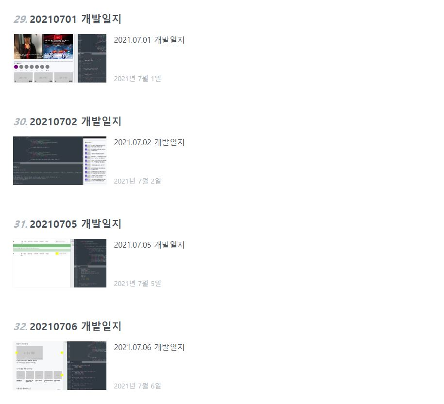
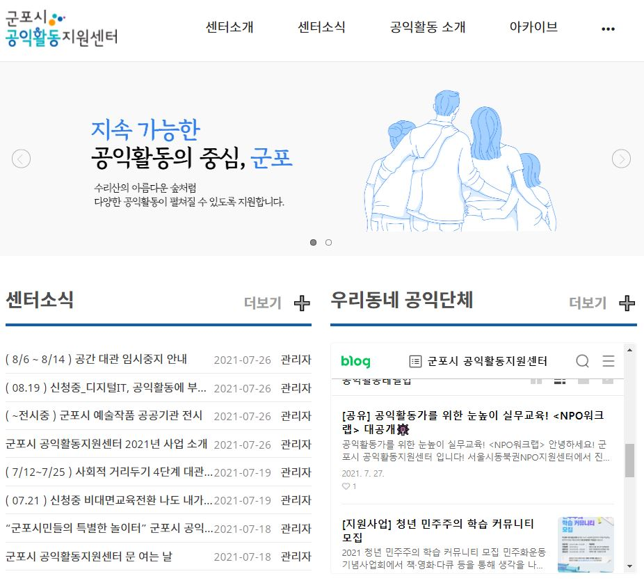

<!DOCTYPE html>
<html lang="en">
    <head>
        <meta charset="utf-8" />
        <meta name="viewport" content="width=device-width, initial-scale=1, shrink-to-fit=no" />
        <meta name="description" content="" />
        <meta name="author" content="" />
        <title>포트폴리오</title>
        <link rel="icon" type="image/x-icon" href="assets/favicon.ico" />
        <!-- 무료 홈페이지 아이콘 사용 -->
        
        <!-- Google fonts-->
        <link href="https://fonts.googleapis.com/css?family=Varela+Round" rel="stylesheet" />
        <link href="https://fonts.googleapis.com/css?family=Nunito:200,200i,300,300i,400,400i,600,600i,700,700i,800,800i,900,900i" rel="stylesheet" />
        <!-- Core theme CSS (includes Bootstrap)-->
        <link href="css/styles.css" rel="stylesheet" />
    </head>

    <body id="page-top">
        <!-- Navigation-->
        <nav class="navbar navbar-expand-lg navbar-light fixed-top" id="mainNav">
            

                <a class="navbar-brand" href="#page-top">이진솔 Homepage</a>
                <button class="navbar-toggler navbar-toggler-right" type="button" data-bs-toggle="collapse" data-bs-target="#navbarResponsive" aria-controls="navbarResponsive" aria-expanded="false" aria-label="Toggle navigation">
                    메뉴 
                    <i class="fas fa-bars"></i>
                </button>
                

                    <ul class="navbar-nav ms-auto">
                        <li class="nav-item"><a class="nav-link" href="#about">웹프로그래밍 시작</a></li>
                        <li class="nav-item"><a class="nav-link" href="#projects">프로젝트</a></li>
                        <li class="nav-item"><a class="nav-link" href="#signup">연락처</a></li>
                    </ul>
                

            

        </nav>
        <!-- 상위 메뉴 -->
        <header class="masthead">
            

                

                    

                        <h1 class="mx-auto my-0 text-uppercase">이진솔 홈페이지</h1>
                        <h2 class="text-white-50 mx-auto mt-2 mb-5">이 홈페이지는  포트폴리오를 위해 제작되었습니다.</h2>
                        <a class="btn btn-primary" href="#about">홈페이지 둘러보기</a>
                    

                

            

        </header>

        <!-- About-->
        <section class="about-section text-center" id="about">
            

                

                    

                        <h2 class="text-white mb-4">제작자 : 이진솔</h2>
                        

                            이 사이트는 공개된 홈페이지 소스를 활용하여 제작되었습니다.
                        

                    

                

           <!--       -->
            

        </section>

        <!-- Projects-->
        <section class="projects-section bg-light" id="projects">
            

                <!-- Featured Project Row-->
                

                    

                    

                        

                            <h4>시작하면서..</h4>
                            
처음 서울시 청년일자리를 시작했을 때, 
                            웹 프로그래밍을 잘 할 수 있을지 고민이 많았습니다. 
                            하지만 좋은 강사님과 조원들을 만나 성장할 수 있었습니다.

                        

                    

                

                <!-- 구성1 Velog 설명 -->
                

                    

                    

                        

                            

                                

                                    <h4 class="text-white">Velog</h4>
                                    
2021.05.24 개발일지를 시작으로 
                                        프로젝트 마무리까지 차곡차곡 쌓아올라가고 있습니다.
                                    

                                    

                                

                            

                        

                    

                

                <!-- 구성2 프로젝트 설명 -->
                

                    

                    

                        

                            

                                

                                    <h4 class="text-white">프로젝트</h4>
                                    
2021.07.05. 프로젝트 조 선정부터 시작해서 
                                    2021.08.06. 프로젝트 마무리까지                                     
                                    <a href="https://gp4citizen.imweb.me/index">군포시 공익활동지원센터 홈페이지</a>
                                    를 제작했습니다.
                                    

                                    

                                

                            

                        

                    

                

            

        </section>
        <!-- Signup-->
        <section class="signup-section" id="signup">
            

                

                    

                        <i class="far fa-paper-plane fa-2x mb-2 text-white"></i>
                        <h2 class="text-white mb-5">홈페이지 갱신정보를 확인하려면 
                         이메일을 기입해주세요.</h2>
                        <!-- * * * * * * * * * * * * * * *-->
                        <!-- * * SB Forms Contact Form * *-->
                        <!-- * * * * * * * * * * * * * * *-->
                        <!-- This form is pre-integrated with SB Forms.-->
                        <!-- To make this form functional, sign up at-->
                        <!-- https://startbootstrap.com/solution/contact-forms-->
                        <!-- to get an API token!-->
                        <form class="form-signup" id="contactForm" data-sb-form-api-token="API_TOKEN">
                            <!-- Email address input-->
                            

                                
<input class="form-control" id="emailAddress" type="email" placeholder="이메일 주소를 입력해주세요." aria-label="Enter email address..." data-sb-validations="required,email" />

                                
<button class="btn btn-primary disabled" id="submitButton" type="submit">확인!</button>

                            

                            
이메일이 정상등록되었습니다.

                            
유효하지않은 이메일 주소입니다.

                            <!-- Submit success message-->
                            <!---->
                            <!-- This is what your users will see when the form-->
                            <!-- has successfully submitted-->
                            

                                

                                    
Form submission successful!

                                    To activate this form, sign up at
                                     
                                    <a href="https://startbootstrap.com/solution/contact-forms">https://startbootstrap.com/solution/contact-forms</a>
                                

                            

                            <!-- Submit error message-->
                            <!---->
                            <!-- This is what your users will see when there is-->
                            <!-- an error submitting the form-->
                            

Error sending message!

                        </form>
                    

                

            

        </section>

        <!-- Contact-->
        <section class="contact-section bg-black">
            

                

                    

                        

                            

                                <i class="fas fa-map-marked-alt text-primary mb-2"></i>
                                <h4 class="text-uppercase m-0">주소</h4>
                                

                                
110, Sejong-daero, Jung-gu, Seoul, Republic of Korea

                            

                        

                    

                     <!-- 서울특별시 시청 주소로 체크 -->
                    

                        

                            

                                <i class="fas fa-envelope text-primary mb-2"></i>
                                <h4 class="text-uppercase m-0">Email</h4>
                                

                                
<a href="#!">jinsol.lee_seoul2021@techsoupkorea.kr</a>

                            

                        

                    

                     <!-- 교육하는 주소로 체크 -->
                    

                        

                            

                                <i class="fas fa-mobile-alt text-primary mb-2"></i>
                                <h4 class="text-uppercase m-0">연락처</h4>
                                

                                
+82 10-493x-xxxx

                            

                        

                    

                

                

                    <a class="mx-2" href="#!"><i class="fab fa-twitter"></i></a>
                    <a class="mx-2" href="#!"><i class="fab fa-facebook-f"></i></a>
                    <a class="mx-2" href="#!"><i class="fab fa-github"></i></a>
                

            

        </section>
        <!-- Footer-->
        <footer class="footer bg-black small text-center text-white-50">
Copyright &copy; Your Website 2021
</footer>
        <!-- Bootstrap core JS-->
        
        <!-- Core theme JS-->
        
        <!-- * * * * * * * * * * * * * * * * * * * * * * * * * * * * * * * * * * * * * * * *-->
        <!-- * *                               SB Forms JS                               * *-->
        <!-- * * Activate your form at https://startbootstrap.com/solution/contact-forms * *-->
        <!-- * * * * * * * * * * * * * * * * * * * * * * * * * * * * * * * * * * * * * * * *-->
        
    </body>
</html>
